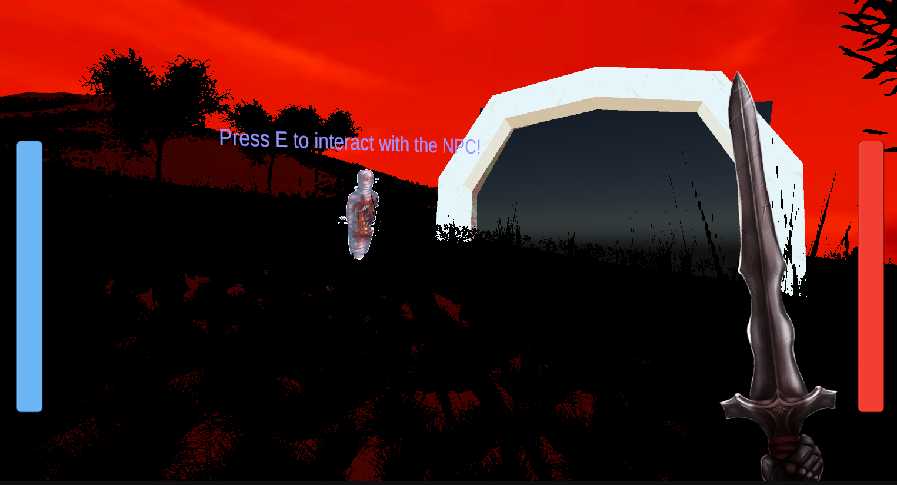
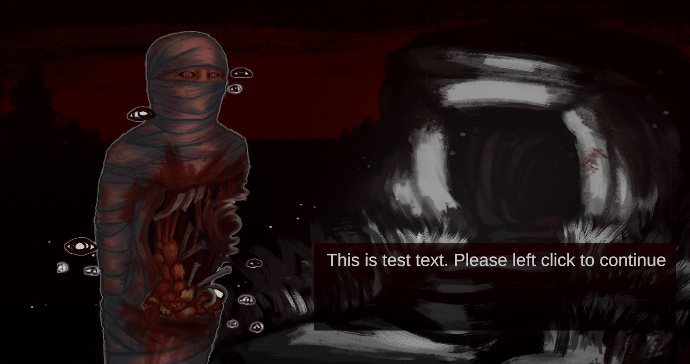
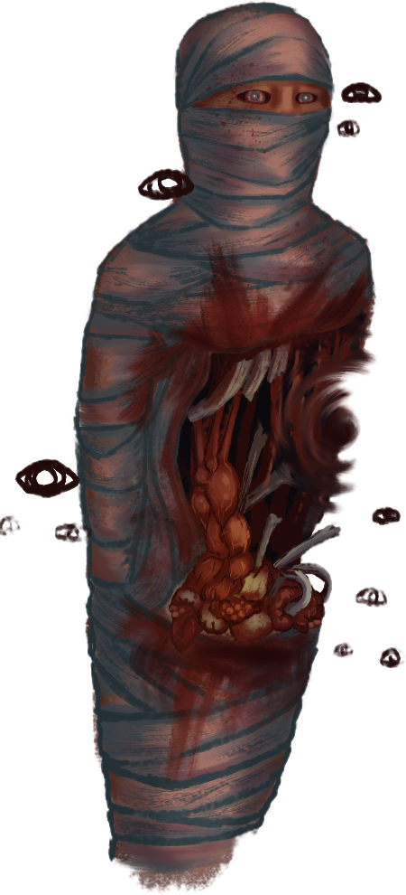
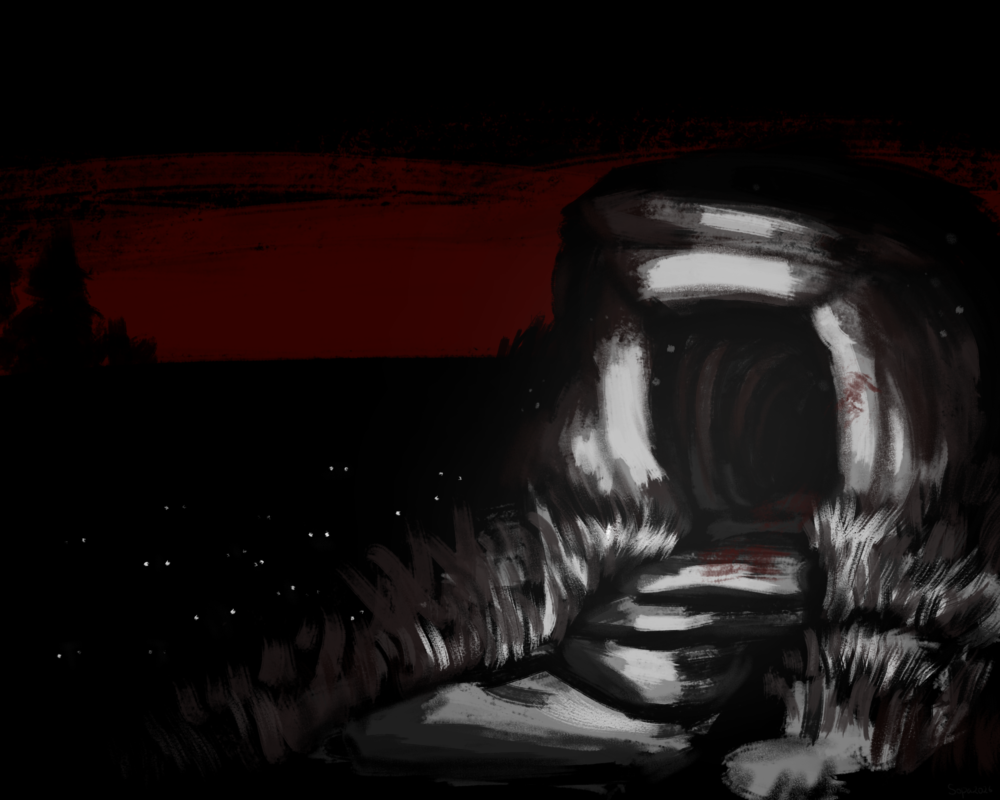

# NPC Interaction Test  
*Valid as of 24/02/26*

## Controls

The key controls and functions used for NPC interaction are:

- **E** – Begin interaction with an NPC when in range *(DONE)*
- **Left Mouse Button** – Progress through NPC dialogue *(DONE)*

The overall interaction system, at a basic level, is complete. Currently, only one set of dialogue is present before exiting back to gameplay.

In the future, I would like multiple lines of dialogue to appear when clicking. Once all dialogue is exhausted, clicking will return the player to normal gameplay.

---

## Current Position

The player's moveset is working as intended. The UI has improved significantly and now includes:

- A **health bar**
- An **animated weapon** that swings when the player attacks

The health bar functions correctly. When the player is hit, their health decreases by a specific amount. At the moment, this damage value is static, but due to how the system is coded, I can easily introduce varying damage values later if needed.

There are currently **three swords** available. These are visual changes only, but all function correctly.

My next focus is on improving enemies and expanding their behaviour systems.

### System Status

- Enemies *(NEEDS POLISH)*
- Projectiles *(NOT DONE)*
- Bosses *(NOT DONE)*

---

## Testing Scene

All testing for NPC interaction is located in the **“NPC Interaction Test”** scene.

## Interaction Limitation (Current Issue)

The only issue I am currently experiencing is that the player can interact with the NPC as long as they are within the NPC's interaction range.

Ideally, the player should be:
- Within range **and**
- Looking directly at the NPC

For now, the current implementation works well for testing purposes.

*Figure 1: NPC Interaction Test scene used for dialogue system testing*
---

## Interaction Screen

Once the player presses **E** while near the NPC, they are brought to the interaction screen shown below.

*Figure 2: Dialogue interaction screen.*

---

## Artwork / Sprites

